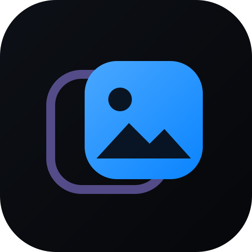
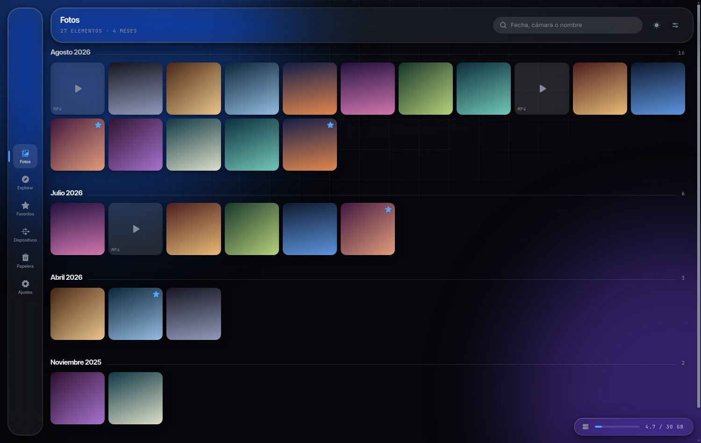
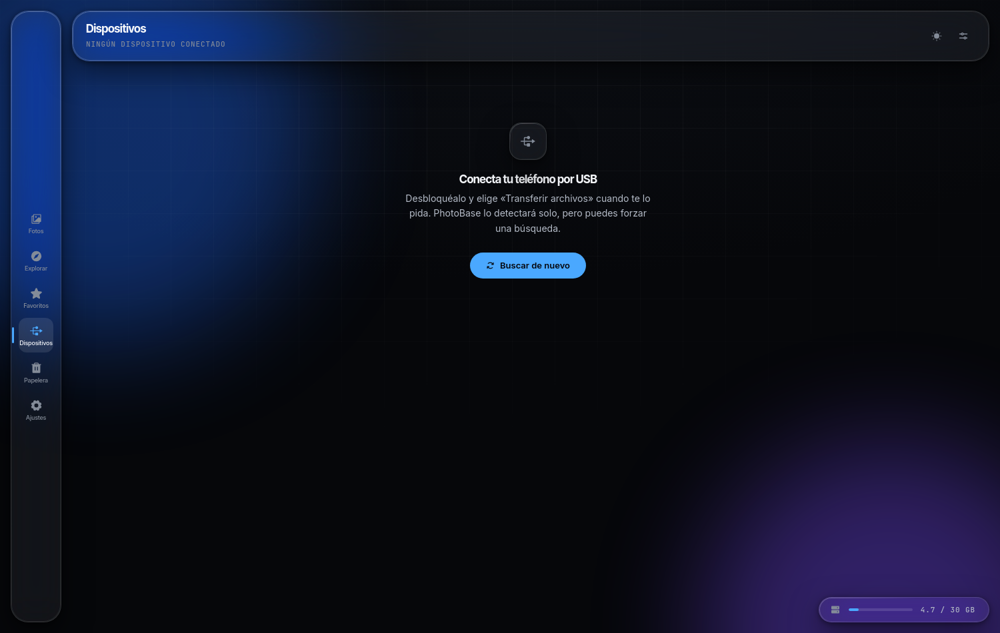
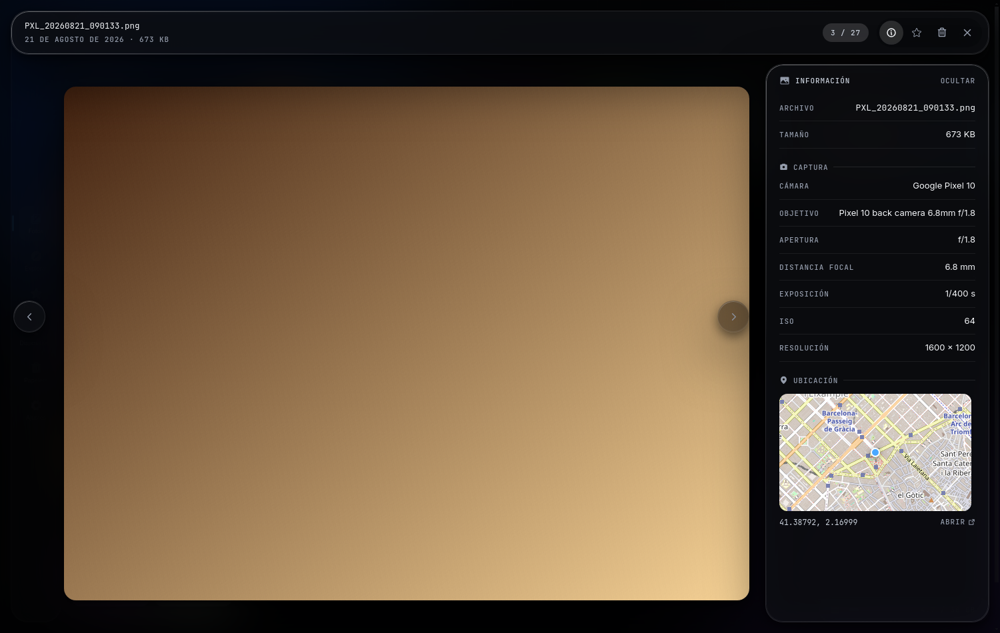
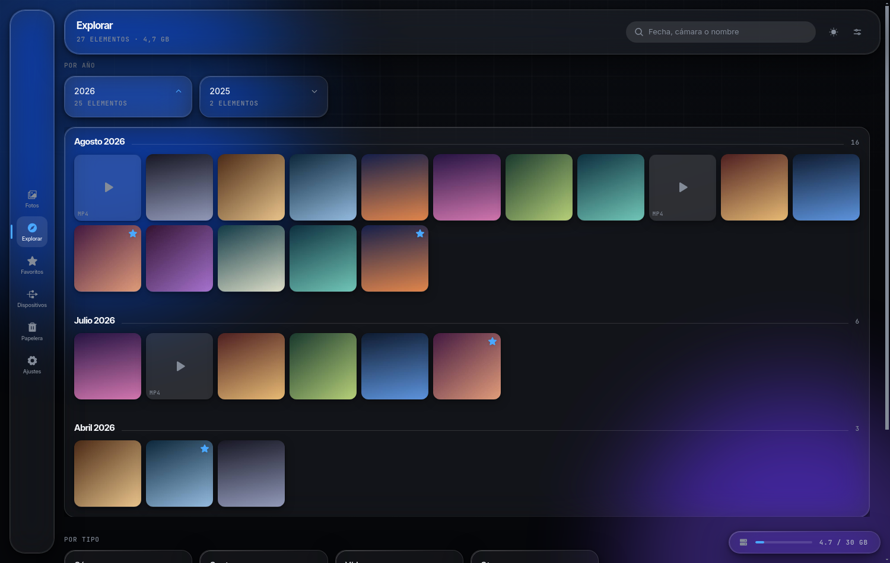
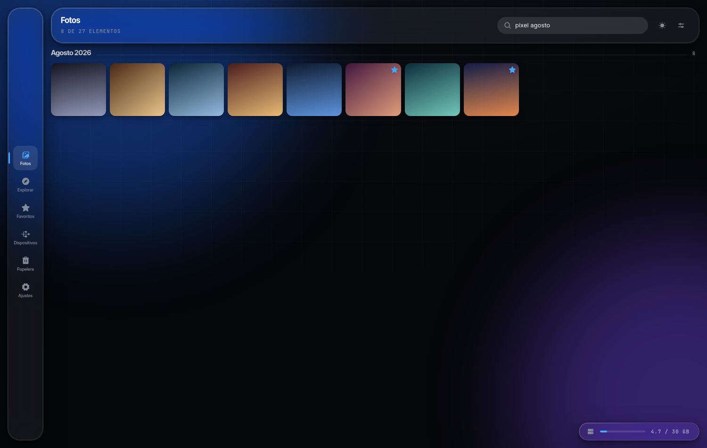
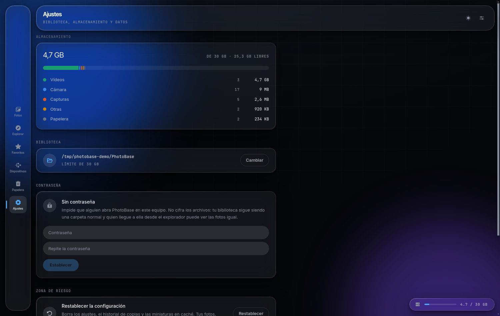
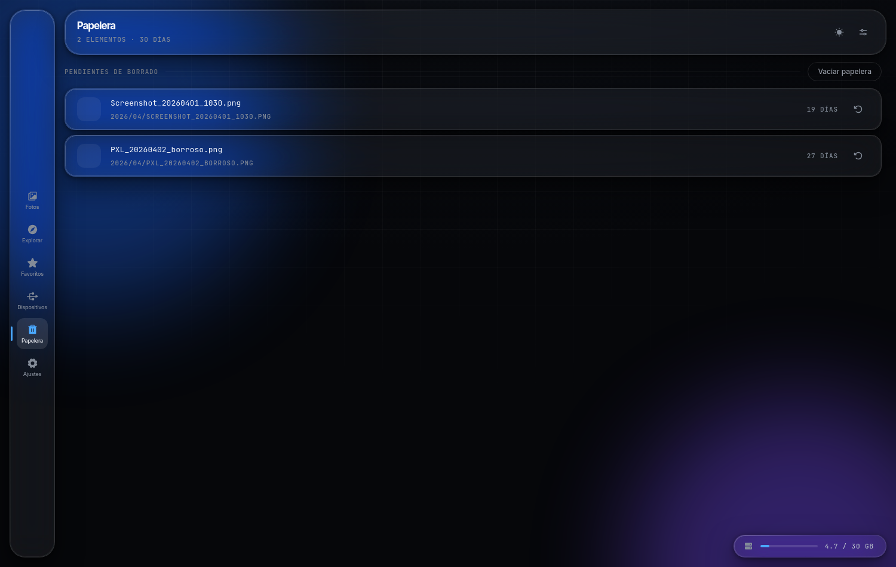
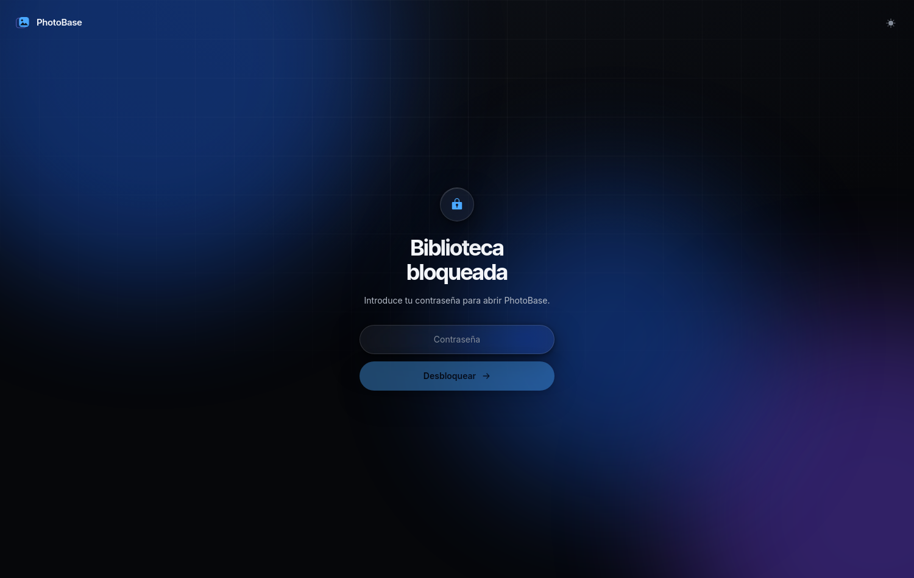
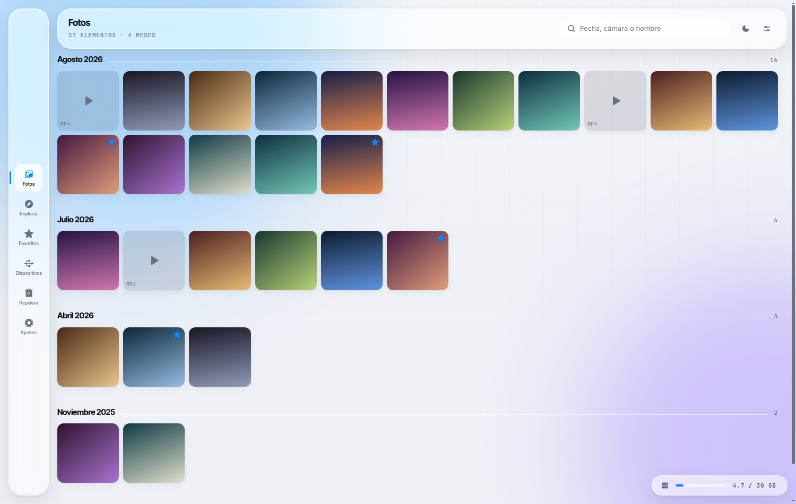

<div align="center">



# PhotoBase

**Tu biblioteca de fotos y vídeos, en tu disco y en tus manos.**

Un gestor de fotos local para Windows. Copia lo que hay en tu móvil, lo ordena por
fecha y te deja buscarlo — sin nube, sin cuenta y sin sincronizar nada con nadie.



</div>

---

## Qué es

PhotoBase hace una sola cosa y la hace entera: conectas el móvil por USB y se trae
tus fotos y vídeos a tu ordenador, organizados en carpetas `AÑO/MES` que puedes
abrir con el explorador de Windows aunque PhotoBase no esté instalado.

No hay servidor. No hay cuenta. No hay subida. Tus archivos se quedan en la carpeta
que tú elijas y nadie más los ve.

| | |
|---|---|
| **Copia por USB** | Detecta el móvil por MTP y copia solo lo que falta |
| **Nunca borra del móvil** | La copia es de una dirección: lo del teléfono se queda donde está |
| **Organización por fecha** | `2026/08/PXL_20260806_214636.jpg`, legible sin la app |
| **Fotos y vídeos** | JPEG, PNG, HEIC, DNG, MP4, MOV, MKV, WEBM… |
| **Límite de almacenamiento** | Tú pones el tope en GB y la app no lo pasa |
| **Metadatos EXIF** | Cámara, objetivo, apertura, ISO y ubicación |
| **Papelera con 30 días** | Borrar no es perder |
| **Bloqueo por contraseña** | Opcional, con hash scrypt |

---

## Copia de seguridad por USB

Enchufas el móvil, desbloqueas y eliges «Transferir archivos». PhotoBase lo detecta
solo y recorre **todo el almacenamiento**: `DCIM`, `Pictures`, `Movies`, `Download`,
las carpetas que crean Instagram o WhatsApp, las que inventa el fabricante y las que
cuelgan de `Android/media`. No adivina qué carpetas «cuentan» — las mira todas.

Solo se salta las cachés (carpetas que empiezan por punto, como `.thumbnails`) y los
sandbox de aplicaciones `Android/data` y `Android/obb`.



**Cómo sabe qué copiar.** Cada archivo se identifica por nombre y tamaño exacto, y
una copia solo se da por buena cuando el archivo en destino mide **exactamente** lo
mismo que en el móvil. Esto importa con los vídeos: `CopyHere` de Windows devuelve
el control al instante y sigue escribiendo el archivo por detrás, así que comprobar
solo que «existe» da por copiado un vídeo de 2 GB a los pocos milisegundos y te deja
un archivo truncado para siempre. PhotoBase espera a que el tamaño cuadre, sin reloj:
mientras el archivo crezca, sigue esperando.

---

## Visor y metadatos

Las fotos se abren dentro de la app, con la chrome flotando sobre la imagen. Flechas
del teclado para moverte, `Esc` para salir.



El botón de información lee el EXIF del archivo: cámara, objetivo, apertura, distancia
focal, exposición, ISO y resolución. Si la foto lleva GPS, se dibuja el mapa.

---

## Explorar

Agrupa la biblioteca por año, por tipo y por mes. Pulsa cualquier bloque y sus fotos
se despliegan debajo.



---

## Búsqueda

Busca por nombre de archivo, mes, año, tipo o por la cámara con la que se hizo la
foto. Ignora tildes y mayúsculas, y cada palabra que añades estrecha el resultado.



Los metadatos se indexan en segundo plano una sola vez por archivo, así que buscar es
instantáneo por muy grande que sea la biblioteca.

---

## Almacenamiento

Tú decides cuánto disco puede ocupar PhotoBase. Al llegar al tope no borra nada: se
niega a copiar más y te dice cuánto necesitaría.



---

## Papelera y bloqueo

Lo que borras va a una papelera con cuenta atrás de 30 días y se puede restaurar a su
sitio original.

<div align="center">


</div>

La contraseña es **opcional** y evita que alguien abra PhotoBase en tu equipo. No
cifra los archivos: tu biblioteca sigue siendo una carpeta normal, y quien llegue a
ella desde el explorador puede ver las fotos igual. Está dicho así dentro de la app,
a propósito.

---

## Tema claro y oscuro

<div align="center">

</div>

---

## Instalación

Descarga el instalador de la [última versión](https://github.com/F3LIP3X/PhotoBase/releases)
y ejecútalo. No necesita nada más.

### Compilar desde el código

```bash
corepack enable
pnpm install
pnpm build:win     # o build:linux / build:mac
```

El instalador queda en `dist/`.

---

## Desarrollo

```bash
pnpm dev      # Electron + Vite con recarga en caliente
pnpm lint     # ESLint sobre todo el código
pnpm build    # compila main, preload y renderer
```

**Requisitos:** Node.js 20 o superior y pnpm (`corepack enable`).

### Cómo está montado

```
src/
  main/          Proceso principal: acceso al disco y al móvil
    devices/     Detección MTP y copia por PowerShell + Shell COM
    library/     Escaneo, miniaturas, metadatos, papelera, cuota
  preload/       El único puente entre el renderer y el sistema
  renderer/      React + Tailwind, tokens de diseño en Styles/Tokens
```

El renderer nunca toca el disco. Pide todo por un puente estrecho que expone unas
pocas llamadas concretas, y las fotos se sirven por un esquema propio (`photobase://`)
que solo alcanza dentro de la carpeta de la biblioteca.

---

## Privacidad

PhotoBase no envía tus fotos a ningún sitio. La aplicación funciona entera sin
conexión, **con una excepción que conviene conocer**: si abres el panel de metadatos
de una foto que lleva coordenadas GPS, el mapa pide sus imágenes a
`tile.openstreetmap.org` y eso implica enviar esas coordenadas a ese servidor. Si no
abres el panel, no se hace ninguna petición de red.

---

## Estado y limitaciones

- **La copia desde el móvil es solo para Windows.** Usa el shell de Windows por COM
  para hablar MTP. La aplicación arranca y gestiona la biblioteca en Linux y macOS,
  pero ahí no detecta teléfonos.
- **Los vídeos no tienen miniatura.** Generarlas necesitaría un decodificador; la
  cuadrícula dibuja su propia tarjeta con el formato del archivo.
- **No hay reconocimiento de lugares.** Se guardan las coordenadas del EXIF, pero no
  se traducen a nombres de sitio, así que no se puede buscar por lugar.
- **El primer escaneo de un móvil lleno tarda.** Se recorre todo el almacenamiento
  leyendo el tamaño de cada archivo por MTP, que no es un protocolo rápido.

---

<div align="center">
<sub>Proyecto personal de <a href="https://github.com/F3LIP3X">F3LIP3X</a>.</sub>
</div>
